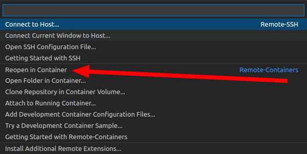

# Big Data Hands-on - Kappa Architecture - Smoke Test

This repository contains the smoke test for the lab.

## Getting started

> *Note: Please follow the [installation docs](https://github.ugent.be/GDV/docs) for the GDV course first.*

1. Clone this repository to your computer using git.
1. Open `lab-kappa-smoketest.code-workspace` using Visual Studio Code.
1. Click on the "Remote" icon on the bottom left of VSCode.

   

   1. Choose the option "Reopen in container" from the command palette.

      

   1. The container will be automatically created based on the configuration included in the lab files.
1. Wait until the container is set up. This can take a few minutes because the container needs to be pulled and built. You can check the progress by clicking "Starting Dev Container (show log)" in the notification on the bottom right of VSCode.
1. When the containers are setup, open `smoketest.ipynb` and press "run all cells". If asked, choose the Python kernel "base (Python 3.9.7)" in `/opt/conda/bin/python`.
1. Wait a while until all cells finish. If no errors show up, everything is OK! Make sure to close VSCode again so all the containers get shut down again.

## Copyright

 This work is licensed under a <a rel="license" href="http://creativecommons.org/licenses/by/4.0/">Creative Commons Attribution 4.0 International License</a>.

Copyright © teaching staff teaching staff of the Faculty of Engineering and Architecture at Ghent University.
